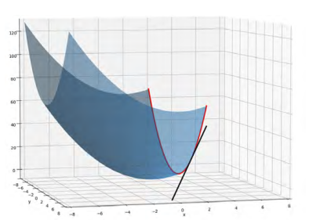

## 1. Partial Derivatives & The Gradient

*   **The Core Concept:** When dealing with multiple variables, a partial derivative measures the rate of change of one specific variable while strictly treating all other variables as constants. 
*   **Visualization:** By holding one variable constant, we slice the 3D loss surface to create a 2D curve (red line), allowing us to find the 1D tangent slope (black line) at that exact point.

*   **The Gradient ($\nabla f$):** As we move into higher dimensions, we calculate the partial derivative for every single variable. Assembling all these partial derivatives into a single vector gives us the gradient, which points in the direction of the steepest ascent on the surface.

## 2. Analytical Optimization vs. Gradient Descent

*   **The Analytical Approach (Setting to Zero):** For simple functions, we can find the minimum by calculating the gradient, setting it exactly to zero, and solving the resulting linear system. For example, in simple linear regression (minimizing the sum of squared distances for points like $(2,5)$, $(3,3)$, and $(1,2)$), we take $\frac{\partial E}{\partial m} = 0$ and $\frac{\partial E}{\partial b} = 0$ and algebraically solve for $m$ and $b$.
*   **The Need for Gradient Descent:** As models step into higher dimensions with non-linear relationships (e.g., $f(x) = e^x - \log(x)$ or complex logistic functions used in probability modeling), the optimization problem becomes impossible to solve analytically. We must abandon algebra and use an iterative algorithmic approach: Gradient Descent.

## 3. The Gradient Descent Algorithm

To find the minimum of a function $f(x,y)$:
1.  **Initialize:** Choose a random starting point $(x_0,y_0)$.
2.  **Define Learning Rate ($\alpha$):** Set the step size for each iteration.
3.  **Update Rule:** Step in the opposite direction of the gradient to travel downhill: 
 $$x_k = x_{k-1} - \alpha \frac{\partial f}{\partial x}(x_{k-1}, y_{k-1})$$
$$y_k = y_{k-1} - \alpha \frac{\partial f}{\partial y}(x_{k-1}, y_{k-1})$$
4.  **Iterate:** Repeat Step 3 until the updates become negligibly small (convergence to the minimum).

**Crucial Algorithm Dynamics:**
*   **Learning Rate Size:** If $\alpha$ is too small, the algorithm takes microscopic steps and may never converge within the iteration limit. If $\alpha$ is too large, it will overshoot the target, bounce wildly around the minimum, and potentially diverge.
*   **Local vs. Global Minima:** Gradient Descent is "greedy" and will settle in the first valley it finds (a local minimum), which may not be the absolute lowest point (the global minimum). To mitigate this, it is standard practice to run the algorithm multiple times from completely different random initialization points.

## 4. Applying Gradient Descent to Linear Regression

While analytical solvers exist, building a custom gradient descent engine for linear regression builds fundamental intuition for how predictive models learn.

*   **The Loss Function (Single Observation):** We measure the squared error between the predicted value $\hat{y}$ and actual value $y$. 
    $$L(m,b) = \frac{1}{2}(\hat{y}^{(i)} - y^{(i)})^2$$ 
    *Note: We multiply by $\frac{1}{2}$ purely as a calculus trick. When we take the derivative, the exponent $2$ drops down and cleanly cancels it out.*
*   **The Cost Function (Entire Dataset):** We average the loss across all $n$ data points. 
    $$E(m,b) = \frac{1}{2n} \sum_{i=1}^{n} (mx^{(i)} + b - y^{(i)})^2$$
*   **Calculating the Partial Derivatives:** 
    $$\frac{\partial E}{\partial m} = \frac{1}{n} \sum_{i=1}^{n} (mx^{(i)} + b - y^{(i)})x^{(i)}$$ 
    $$\frac{\partial E}{\partial b} = \frac{1}{n} \sum_{i=1}^{n} (mx^{(i)} + b - y^{(i)})$$
*   **The Iterative Update:** 
    $$m_{new} = m - \alpha \frac{\partial E}{\partial m}$$ 
    $$b_{new} = b - \alpha \frac{\partial E}{\partial b}$$

## 5. The Necessity of Data Normalization (Z-Score)

Original datasets often contain variables with vastly different units (e.g., combining large dollar amounts with small percentage rates). This creates a heavily skewed, stretched-out loss surface where Gradient Descent struggles to find the center efficiently.

To fix this, we normalize the features (often called Z-score standardization): 
$$x_{normalized} = \frac{x - \mu}{\sigma}$$ 
By subtracting the mean ($\mu$) and dividing by the standard deviation ($\sigma$), all variables are scaled to a similar range. This reshapes the loss surface into a uniform "bowl," allowing the algorithm to step smoothly and efficiently toward the optimal weights.
